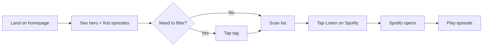
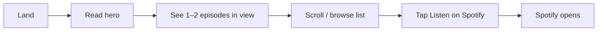
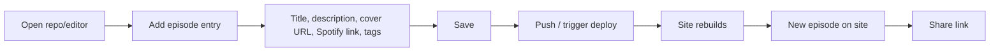
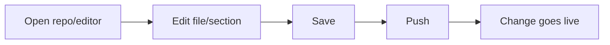

# UX Design Specification storieviola.it

**Author:** Filippo
**Date:** 2026-03-15

---

<!-- UX design content will be appended sequentially through collaborative workflow steps -->

## Executive Summary

### Project Vision

storieviola.it is the single, cost-effective web home for the kids' podcast Storie Viola: original stories created for the creator's daughter and shared with other families. The site lists all episodes with links to Spotify, explains the origin and how the stories are made, and is the one place for "all stories and info" about the project. Episodes can be **tagged** so visitors can **filter the list by tag** to find episodes that match what they want. Success for the creator means minimal-friction updates and deployment (e.g. push → live); for parents it means discoverability, quick understanding of what the podcast is, **easy filtering by tag**, and a one-click path to listen on Spotify.

### Target Users

- **Creator (primary):** Maintainer and content editor; publishes a new story weekly. Needs a simple, repeatable way to add or update episodes (title, description, cover, Spotify link, **and tags**) and deploy so the site stays the canonical list with minimal effort. Tech-comfortable (edit files, push).
- **Parents (secondary):** Discover the site via search or link, understand what the podcast is, browse the episode list, **filter by tag when useful**, and open an episode on Spotify in one click for their kids (e.g. 2–6 years). Mixed tech levels; use mobile and desktop.

### Key Design Challenges

- **Information architecture:** The homepage must answer "what is this?" quickly and expose the episode list and about without clutter, for both first-time and returning visitors.
- **Episode list at scale:** The list must remain scannable and performant as it grows (tens to hundreds of episodes), on mobile and desktop, with clear hierarchy and a visible "Listen on Spotify" action per episode.
- **Tags and filtering:** Tags must be easy for the creator to add and maintain; the filter UI (e.g. by tag) must be discoverable, simple to use on mobile and desktop, and not overwhelm when there are many tags or episodes.
- **Dual audience:** UX must serve both the creator (simplicity of editing and deploy) and the visitor (clarity, trust, one-click to listen) without the former compromising the latter.

### Design Opportunities

- **First impression:** Use podcast identity and warm, concise copy so parents immediately understand "kids' stories, made with care" and feel confident clicking through to Spotify.
- **Episode presentation:** Clear, consistent episode cards or list rows (cover, title, short description, **tags**, single primary CTA) so choosing and clicking is effortless.
- **Filtering by tag:** Let parents narrow the list by tag (e.g. theme, character, mood) so they can quickly find episodes that fit what they want.
- **About as story:** The about page (origin, how it's made) can build trust and differentiate the podcast through authenticity.

## Core User Experience

### Defining Experience

The core experience is getting from landing to playing an episode in as few steps as possible. The one action that must be impossible to get wrong is listening: every episode has one clear "Listen on Spotify" (and the site may also link to the main podcast on Spotify). What should feel effortless first is understanding what the site is within a few seconds. We're not optimising for a single "most frequent" action but for the full path: land → understand → (optionally filter) → choose episode → Spotify.

### Platform Strategy

Web only, responsive. Primary use is likely touch (mobile); desktop is supported. Static site, hosted on GitHub Pages or similar with low or no cost; paying is acceptable only if it meaningfully simplifies maintaining content and deploying. Offline is not required. On mobile, opening Spotify directly (e.g. app or in-app) when the user taps "Listen on Spotify" is a plus.

### Effortless Interactions

- "Listen on Spotify" is one tap per episode.
- By default the list shows all episodes or a "featured" set (e.g. via a tag like "featured") so visitors see something useful immediately.
- No expectation to remove steps versus typical list+link podcast sites; focus is on clarity and reliability of that one tap.

### Critical Success Moments

- **"This is better":** When parents read who is behind the stories and see that the stories are nice and good for young kids.
- **Success:** When they feel relieved because they found stories they can trust that their kids can listen to.
- **Failure to avoid:** Not being able to get to the Spotify episode they want (broken link, wrong destination, or unclear CTA).
- **Make-or-break flow:** Landing → understand what Storie Viola is → (optional: filter by tag) → choose episode → Spotify.
- **First-time success:** Within one visit, the parent understands what Storie Viola is and plays at least one episode.

### Experience Principles

1. **One tap to listen** — One clear "Listen on Spotify" per episode (and optional link to the podcast); no ambiguity.
2. **Instant clarity** — Within seconds, the first screen answers "what is this?" and "who is it for?" (kids' stories, your project).
3. **Trust and relief** — About / who's behind the stories and the quality of the content make parents feel they can trust it for their kids.
4. **Scannable list and tags** — Easy to scan; optional "featured" or "all"; filter by tag when useful, without clutter.
5. **Mobile-first, cost-conscious** — Responsive, touch-friendly; open Spotify directly on mobile when possible; static hosting (e.g. GitHub Pages) unless paying clearly simplifies maintenance and deploy.

## Desired Emotional Response

### Primary Emotional Goals

- **Relief** — Parents feel they've found something that works: stories they can trust and their kids can listen to.
- **Trust** — In who's behind the stories and in the quality (good for young kids).
- **Clarity** — No confusion about what the site is or how to listen.

The primary feeling we're designing for is **relieved trust**: "I can trust this for my kids and it was easy to get here."

### Emotional Journey Mapping

- **First discovery:** Curious but cautious ("Is this right for my kid?"). Design for quick **reassurance** — clear what it is, who it's for, who made it.
- **During the experience:** Scanning and choosing. Design for **confidence** — I can pick an episode; I know what "Listen on Spotify" does.
- **After completing:** Episode is playing (or about to). Design for **relief** and **satisfaction** — "I found something good."
- **If something goes wrong:** e.g. link doesn't work. Avoid **frustration** and **distrust**; design so the path to Spotify is obvious and reliable.
- **Returning:** Design for **familiarity** and **ease** — "I know what to do."

### Micro-Emotions

- **Trust vs. skepticism** — Critical. About/origin and "who's behind it" reduce skepticism and build trust.
- **Relief vs. anxiety** — Critical. "Will I find something appropriate?" → Clear positioning and tags/filter support relief.
- **Confidence vs. confusion** — Important. One clear CTA per episode and instant clarity avoid confusion.
- **Accomplishment vs. frustration** — Important. "I got to the right episode and it's playing" = accomplishment; broken or unclear links = frustration.

### Design Implications

- **Trust** → Visible "who's behind the stories" (about/origin), warm tone, clear that it's for young kids.
- **Relief** → Short path to listening; optional "featured" or tags so they don't feel lost in a long list.
- **Confidence** → One obvious "Listen on Spotify" per episode; no competing or ambiguous CTAs.
- **Avoid frustration/distrust** → Reliable links, correct Spotify destination, simple layout so nothing feels broken or shady.

### Emotional Design Principles

1. **Lead with trust** — First screen and about should answer "who made this?" and "is this for my kid?" so skepticism drops quickly.
2. **Design for relief** — Minimize steps to listening; make the list scannable and optionally filterable so parents don't feel overwhelmed.
3. **One clear action** — Every episode has one primary CTA; no ambiguity about how to listen.
4. **Avoid betrayal** — Links must work; destination must be correct; the experience must feel reliable and honest.

## UX Pattern Analysis & Inspiration

### Inspiring Products Analysis

No specific reference apps were designated. The design direction is **minimal and clear**, with **least friction** along the path: understand → search/filter (if needed) → click to listen on Spotify. We adopt a **simple podcast** approach: clear identity, scannable episode list, one primary CTA per episode, optional tag filter. The main constraint from stakeholder input: **the hero must not be the only thing visible on first load**. The podcast image, title, and short description should be visible **alongside** at least 1 or 2 episodes so visitors see both "what this is" and the start of the list without scrolling past a full-screen hero.

### Transferable UX Patterns

- **Above-the-fold balance:** Compact hero (image + title + short description) with the start of the episode list visible in the same view — supports instant clarity and one-tap to listen without a hero-only first screen.
- **Simple podcast list:** One row/card per episode: cover, title, short description, tags (if any), single primary "Listen on Spotify" CTA. Consistent, scannable, minimal.
- **Optional filtering:** Tag filter (e.g. chips or dropdown) near the list; "All" or "Featured" as default so the list is immediately useful.
- **Trust in the open:** About/origin linked from the header or hero area so "who's behind this" is one click away without dominating the first screen.
- **Single primary CTA per episode:** No competing buttons; one clear action to open the episode on Spotify.

### Anti-Patterns to Avoid

- **Hero-only first screen:** Avoid a full-screen hero or long intro that hides the episode list. At least 1–2 episodes must be visible alongside the hero (image, title, description).
- **Clutter and multiple CTAs:** Avoid several links or buttons per episode (e.g. "Listen," "Share," "Save") that dilute the primary action.
- **Unclear hierarchy:** Avoid burying "what is this?" or making the path to Spotify ambiguous.
- **Heavy or decorative UI:** Avoid unnecessary animation, complex navigation, or visual noise that slows understanding or adds friction.
- **Broken or wrong links:** Avoid any link that doesn't open the correct Spotify episode or podcast; this undermines trust.

### Design Inspiration Strategy

**What to adopt:**

- Minimal, clear layout with compact hero and episode list start visible together.
- Simple podcast list pattern: cover, title, description, tags, one "Listen on Spotify" per episode.
- Optional tag filter with a sensible default (e.g. All or Featured).
- One primary CTA per episode; link to main podcast where useful.

**What to adapt:**

- "Simple podcast" pattern adapted to static site and optional tags/featured; no app-specific features.
- Hero adapted so it shares the first view with 1–2 episodes rather than occupying the full fold.

**What to avoid:**

- Full-screen or hero-only first view; hero and at least 1–2 episodes must be visible together.
- Multiple CTAs per episode, unclear hierarchy, heavy UI, and any unreliable or incorrect Spotify links.

## Design System Foundation

### Design System Choice

**Utility-first CSS (e.g. Tailwind CSS)** as the primary design foundation. No heavy component library; custom components (compact hero, episode list, episode card, tag filter, single CTA per episode) are built with utilities and minimal custom CSS. Alternative: custom CSS with design tokens (variables) if a zero-framework approach is preferred.

### Rationale for Selection

- Aligns with minimal, clear UI and static-site hosting (e.g. GitHub Pages); no runtime component framework required.
- Fast to implement and maintain for a single developer; supports responsive, mobile-first layout and compact hero + list on first view.
- Keeps bundle size small (purge unused utilities); no unnecessary abstraction for a simple podcast list and about page.
- Design tokens (e.g. typography, spacing, primary CTA color) can be defined via Tailwind config or CSS variables for consistency.

### Implementation Approach

- Use Tailwind (or chosen utility-first tool) for layout, typography, spacing, and color; define a small set of tokens for brand and consistency.
- Build a small set of custom "components" in code: hero block, episode card (cover, title, description, tags, one "Listen on Spotify" link), tag filter, header with link to about.
- Ensure one primary CTA per episode and touch-friendly targets; avoid adding extra UI that doesn't support the core path (understand → filter → listen).

### Customization Strategy

- Limit palette and type scale to support clarity and trust (readable text, clear hierarchy, one accent for primary CTA).
- Reuse the same episode card and CTA pattern everywhere so the experience stays consistent and minimal.
- If switching to custom CSS later, keep structure semantic (HTML) and isolate tokens so a small CSS layer can replace the utility layer.

## 2. Core User Experience (Defining Interaction)

### 2.1 Defining Experience

The defining experience is **"Land, understand, choose, one tap to listen."** Visitors see what the site is (compact hero: image, title, description) and the start of the episode list in the same view. They can optionally filter by tag, then tap one clear "Listen on Spotify" per episode. The core action we must nail is **one tap from the site to the correct episode on Spotify**; the supporting moment is **instant clarity** (what this is, who it's for) without scrolling past a full-screen hero.

### 2.2 User Mental Model

- Parents bring a "podcast/show website" mental model: they expect to see what the show is, a list of episodes, and a way to listen. They may compare to Spotify or other podcast sites.
- They assume "Listen on Spotify" opens Spotify (app or web) to that episode. Confusion or wrong destination breaks trust.
- Filtering by tag fits a "browse by category" model; "Featured" or "All" as default matches "show me something useful immediately."

### 2.3 Success Criteria

- **"This just works"**: User understands what Storie Viola is within seconds, sees at least 1–2 episodes without scrolling, and can open an episode on Spotify with one tap.
- **Feels successful**: Episode is playing (or about to) on Spotify; user feels relieved they found something they trust for their kids.
- **Feedback**: Link opens the correct Spotify episode; no dead ends or wrong destinations. On mobile, Spotify app opens when appropriate.
- **Speed**: Page loads and becomes usable within a few seconds; tap-to-Spotify feels immediate.

### 2.4 Novel vs. Established Patterns

- **Mostly established**: Simple podcast list, one primary CTA per episode, about page for trust. No new interaction paradigm.
- **Our twist**: Compact hero and first episodes visible together (no hero-only first screen); optional tag filter and "Featured" default; emphasis on trust (who's behind the stories) and relief (stories for young kids).

### 2.5 Experience Mechanics

**1. Initiation**

- User lands on homepage (or follows link to it). Trigger: first paint shows compact hero (image, title, short description) and the start of the episode list.

**2. Interaction**

- User reads hero, scans list; optionally taps a tag to filter. User taps "Listen on Spotify" on one episode. System: link uses correct Spotify URL (episode or podcast); on mobile, opens Spotify app when possible.

**3. Feedback**

- Success: Spotify opens to the right episode (or podcast). No intermediate modal or extra step. If link fails, user sees browser error; we avoid this by keeping links correct and validated.

**4. Completion**

- User is on Spotify with the episode (or podcast) open. Outcome: they can play. Next: they may return to the site to pick another episode or read about.

## Visual Design Foundation

### Color System

- **Approach:** Minimal palette to support clarity and trust. No brand guidelines specified; foundation can be updated when brand colors are defined.
- **Semantic roles:** Background (light neutral); text (dark neutral for body, slightly lighter for secondary); primary CTA ("Listen on Spotify") uses a single accent color (e.g. Spotify green or a custom accent) so the action is obvious. No competing accent colors.
- **Accessibility:** Text and CTA meet WCAG 2.1 AA contrast (4.5:1 for normal text, 3:1 for large text and UI). Avoid low-contrast or decorative colors for critical UI.

### Typography System

- **Tone:** Friendly and readable; suitable for "kids' stories" without looking childish. Clear hierarchy so "what is this" and episode titles stand out.
- **Scale:** One level for site/podcast title (hero), one for episode titles, one for short descriptions and body (about page). Line heights support readability (e.g. 1.4–1.6 for body).
- **Fonts:** Prefer system fonts or a single readable sans for speed and simplicity; optional secondary font for headings if a "story" feel is desired. No requirement for custom brand fonts in MVP.

### Spacing & Layout Foundation

- **Layout feel:** Airy enough that hero (image, title, description) and the start of the episode list sit in the same view without crowding; consistent gaps between episode cards and between sections.
- **Spacing unit:** Use a consistent base (e.g. 4px or 8px) and scale (e.g. 8, 16, 24, 32) for padding and margins so the compact hero + list layout stays predictable.
- **Grid:** Simple responsive grid for episode list (e.g. 1 column on mobile, 2 or more on larger screens as needed); hero and list share the same max-width and padding for alignment.

### Accessibility Considerations

- **Contrast:** All text and the primary CTA meet WCAG 2.1 AA. Avoid light gray text on white or dark gray on black.
- **Focus:** Visible focus styles on "Listen on Spotify" links and tag filters so keyboard and assistive-tech users can see focus.
- **Touch targets:** Buttons/links large enough for touch (e.g. min 44px height or padding) on mobile.
- **Structure:** Semantic headings and list markup so screen readers can navigate by "what is this" and episode list.

## Design Direction Decision

### Design Directions Explored

Three layout directions were created and are available in `ux-design-directions.html`:

- **Direction A – Minimal list:** Hero (image, title, description) on the left; episode list on the right so identity and first episodes appear in the same view. Stacks vertically on mobile.
- **Direction B – Card grid:** Compact hero bar at top; episodes as cards in a responsive grid; one CTA and tags per card.
- **Direction C – Single column:** Centered hero, then a single-column episode list; maximum clarity, one column on all breakpoints.

All three respect the constraint that the hero is not the only content on first load (at least 1–2 episodes visible alongside).

### Chosen Direction

**Responsive hybrid:** **Direction B on desktop**, **Direction C on mobile.**

- **Desktop:** Card grid — compact hero bar at top (image, title, description), then episodes as cards in a responsive grid. Clear scan, one CTA and tags per card.
- **Mobile:** Single column — centered hero (image, title, description), then a single-column episode list. Maximum clarity and thumb-friendly flow on small screens.

### Design Rationale

- Desktop benefits from the card grid (B): more episodes in view, scannable layout, still with hero + first episodes visible together.
- Mobile benefits from the single column (C): less horizontal complexity, clear top-to-bottom reading, and larger touch targets in a list.
- Combined, the layout adapts to viewport: same content and one-tap-to-Spotify pattern, with layout tuned per breakpoint.

### Implementation Approach

- Implement responsive layout: use Direction B layout (hero bar + card grid) above a chosen breakpoint (e.g. 768px or 64rem); use Direction C layout (centered hero + single-column list) below that breakpoint.
- Reuse one episode card/row component with the same content (cover, title, description, tags, one "Listen on Spotify" link); only the container (grid vs single column) and hero placement change by breakpoint.
- Ensure hero + at least 1–2 episodes are visible on first load on both desktop and mobile.
- Tag filter (e.g. chips or dropdown) near the list with sensible default (All or Featured); same behaviour on both breakpoints.

## User Journey Flows

Critical journeys from the PRD are detailed below with flow mechanics. Layout follows the chosen direction: B (card grid) on desktop, C (single column) on mobile.

### Parent – Find stories and play one

**Goal:** Land on the site, understand what it is, choose an episode, and open it on Spotify in one tap.

**Entry:** Search (e.g. "storie per bambini", "storie viola") or direct link → homepage.

**Flow:**

- **Steps:** (1) Land → (2) See hero (image, title, description) and first episodes in same view. (3) Optionally tap a tag to filter. (4) Scan list (cards on desktop, list on mobile). (5) Tap "Listen on Spotify" on one episode. (6) Spotify opens to that episode (or podcast). (7) User plays.
- **Success:** Episode is playing on Spotify; user felt relieved and trusted the path.
- **Failure to avoid:** Wrong or broken link; unclear CTA. Mitigation: validate links, single primary CTA per episode.

### Parent – First visit, scanning the list

**Goal:** Arrive (from link or search), quickly understand what the site is and scan the list without getting lost.

**Entry:** Same as above. Different emphasis: no filter, just scan.

- **Steps:** Land → read hero (what is this, who it's for) → see first episodes without scrolling (per spec) → scroll to browse more if needed → tap "Listen on Spotify".
- **Success:** Clear hierarchy (headings, short descriptions, visible CTA); user chooses an episode and opens Spotify without confusion.
- **Optimization:** Hero and list in same view; no hero-only first screen; one CTA per episode.

### Creator – New episode goes live

**Goal:** After publishing on Spotify, add the episode to the site (title, description, cover, link, tags) and have it go live with minimal effort.

**Entry:** Creator has published on Spotify; opens repo or editor.

- **Steps:** (1) Open project. (2) Add one entry (title, short description, cover image ref, Spotify link, tags). (3) Save and push (or trigger deploy). (4) Build runs; site updates. (5) New episode appears on homepage with correct art and link. (6) Creator shares storieviola.it or episode link.
- **Success:** Episode visible on site within minutes; no broken links; single repeatable flow.
- **Note:** This journey is content/workflow, not site UI; the site UX is the public-facing layout (B/C). Creator UX is "edit data → push → done".

### Creator – Fix typo or update about page

**Goal:** Edit episode description or about/origin content and publish the change without affecting the rest of the site.

- **Steps:** Open project → edit the right file or section (episode data or about content) → save → push. Change goes live; no manual redeploy; no broken links.
- **Success:** Fix or update is live; creator rarely needs to redo work.

### Journey Patterns

- **Navigation:** Header with site title + link to About on every page. Homepage = hero + episode list (+ optional tag filter). No deep hierarchy; 1–2 levels.
- **Decision:** Only meaningful choice on site is "which episode?" and optionally "filter by tag?". One primary action per episode (Listen on Spotify).
- **Feedback:** Tap CTA → Spotify opens. No in-page success message required; success is "I'm on Spotify with the right episode". Errors: browser or Spotify handles; we prevent by correct URLs.

### Flow Optimization Principles

- **Minimize steps to value:** Parent: land → see hero + list → (optional filter) → one tap to Spotify. No extra modals or steps.
- **Reduce cognitive load:** Single primary CTA per episode; clear "what is this?" in hero; tag filter simple (chips or single dropdown).
- **Clear feedback:** Link opens correct destination; if link fails, standard browser behaviour; ensure links are valid and stable.
- **Edge cases:** Long list: list remains scrollable and performant (and optionally filterable by tag). Creator: edit → push → live; no special error UX beyond normal git/deploy.

## Component Strategy

### Design System Components

The foundation is utility-first CSS (e.g. Tailwind). No prebuilt component library is used. We rely on:

- **Layout utilities:** Grid, flex, spacing, max-width, responsive breakpoints.
- **Typography and color:** Type scale, font weights, text and background colors (from Visual Design Foundation).
- **Borders and focus:** Rounded corners, borders, focus rings for links and buttons.

All custom components are built by composing these utilities and, where useful, a small set of design tokens (e.g. spacing scale, primary CTA color).

### Custom Components

#### Header

- **Purpose:** Global navigation: site identity (link to home) and entry to About.
- **Content:** Site title (e.g. "Storie Viola"), link "Chi siamo" / "About".
- **States:** Default; hover/focus on links (visible focus ring). No dropdown or mega-menu.
- **Accessibility:** Semantic `<header>`, `<nav>`; links focusable and keyboard-activable; visible focus styles.

#### Hero (compact)

- **Purpose:** Answer "what is this?" and "who is it for?" with image, title, short description; optional podcast-level "Listen on Spotify".
- **Content:** Image, title, 1–2 sentences, optional CTA.
- **Layout:** Desktop (B): horizontal bar (image + text + CTA). Mobile (C): stacked, centered.
- **States:** Default only; no interactive state on the hero block itself (CTA is a link).
- **Accessibility:** Semantic heading (e.g. `<h1>`), alt text for image, link has visible focus.

#### Episode card / row (one component, two layout variants)

- **Purpose:** Present one episode with cover, title, description, tags, and one primary action (Listen on Spotify).
- **Content:** Cover image, title, short description, tag list, one "Listen on Spotify" link.
- **Variants:** Same markup; CSS/layout changes by breakpoint: desktop = card in grid (Direction B), mobile = single-column list row (Direction C).
- **States:** Default; hover/focus on the CTA (no requirement for card hover). Link must have visible focus and sufficient touch target (e.g. min 44px).
- **Accessibility:** One primary link per episode; tags are presentational or links if we make tags filter triggers; image has alt (e.g. episode title).

#### Tag filter

- **Purpose:** Let users filter the episode list by tag (e.g. "Featured", "All", or topic tags).
- **Content:** "All" (or "Featured") + list of tags. One active selection.
- **Actions:** Click/tap a tag to filter; click "All" to show all episodes.
- **States:** Default, selected (active tag), hover/focus. Clear visual distinction for selected state.
- **Accessibility:** Use buttons or links with `aria-pressed` or similar for selection state; keyboard navigable; visible focus.

#### About page content

- **Purpose:** Long-form content for origin and "how it's made"; builds trust.
- **Content:** Prose (headings, paragraphs, maybe list). No custom widgets.
- **Layout:** Single column, max-width for readability; same header as rest of site.
- **Accessibility:** Semantic headings and paragraphs; sufficient contrast and line height (from Visual Design Foundation).

### Component Implementation Strategy

- Build all custom components with the same utility/token set (Tailwind or custom CSS variables) so spacing, type, and colors stay consistent.
- Reuse one **Episode** component: same props (title, description, cover URL, Spotify URL, tags); only layout (card vs row) changes by breakpoint via responsive classes.
- **Header** and **Hero** are used once per page type; **Tag filter** once per list; **About** is one content template.
- Ensure every interactive element (links, filter controls) has visible focus and, on touch devices, adequate target size (e.g. 44px min).
- No new component library dependency; keep bundle and maintenance minimal.

### Implementation Roadmap

- **Phase 1 – Core:** Header, Hero (compact), Episode card/row (with responsive layout), one "Listen on Spotify" link per episode. Enough to ship homepage (hero + list) and one-tap to Spotify.
- **Phase 2 – Filter and About:** Tag filter (with "All" and tags), About page content block. Enables filtering and trust/origin story.
- **Phase 3 – Polish:** Any refinements (e.g. "Featured" default, link to full podcast on Spotify, analytics hooks) without adding new component types.

## UX Consistency Patterns

Consistency rules for the minimal public UI: one primary CTA type, clear links, no forms on the site, simple navigation and filter behaviour.

### Button / CTA Hierarchy

- **Primary action:** One per episode and optionally in the hero: "Listen on Spotify" (or "Ascolta su Spotify"). Single accent color (e.g. Spotify green or brand accent), clear label, one tap/lick. No competing primary actions on the same card or hero.
- **Secondary / tertiary:** Header links (site title, About) are text links, not button style. Tag filter uses chip/button style with a clear selected state; "All" is same pattern. No need for a separate "secondary button" style on the public site.
- **When to use:** Use primary CTA only for the one action that leaves the site to listen (Spotify). All other actions are links styled as links (underlined or distinct by color/focus).

### Feedback Patterns

- **Success:** No in-page success toast or modal. Success = user is on Spotify with the right episode; the browser tab may change. No "Episode opened!" message required.
- **Errors:** If a link fails (e.g. wrong URL), the browser shows its error. We avoid this by validating and maintaining correct Spotify URLs. No custom error modals for "link broken" on the public site.
- **Loading:** If the episode list is built client-side and can be slow, show a simple loading state (e.g. skeleton or "Loading…") so the page doesn’t feel broken. Prefer static build so the list is present on first paint and loading states are minimal or unnecessary.
- **Empty state:** If a tag filter has no results, show a short message (e.g. "No episodes with this tag") and a way to clear the filter (e.g. "All" or "Show all"). No dramatic empty-state illustration required.

### Form Patterns

- **Public site:** No forms (no login, no comment, no search box in MVP). Creator edits content via repo/files, not through the site. Form patterns are out of scope for the public UX spec.
- **If added later:** Use a single, simple pattern: label above field, visible focus, clear primary submit action; keep minimal.

### Navigation Patterns

- **Global:** Header on every page: site title (link to home), "About" link. Same order and style on home and about. No hamburger required if both fit (e.g. on mobile a compact header still shows both).
- **In-page:** Homepage = hero then optional tag filter then episode list. No tabs or secondary nav; filter is the only in-page "navigation" (filter by tag).
- **Back/forward:** Browser back/forward works; no SPA-style history manipulation. Links are normal hrefs to same-site pages (home, about) or external (Spotify).

### Additional Patterns

- **Links to external sites (Spotify):** Open in same tab (so mobile can open the Spotify app when appropriate) or in a new tab if you prefer; be consistent. Use `rel="noopener"` if target="_blank". Clear label: "Listen on Spotify" (or locale equivalent).
- **Tag filter:** One selected state at a time. "All" clears the filter. Selected tag clearly distinct (e.g. filled vs outline). Keyboard navigable (tab through tags, Enter/Space to select).
- **Focus visibility:** All interactive elements (header links, "Listen on Spotify", tag chips) have a visible focus ring that meets WCAG 2.1 AA. No focus trap; natural tab order.
- **Touch targets:** Minimum ~44px height or padding for tap areas on mobile (primary CTA and tag filter). Spacing between tappable items so taps don’t overlap.

## Responsive Design & Accessibility

### Responsive Strategy

- **Desktop:** Use extra width for the card grid (Direction B): compact hero bar at top, then episodes in a responsive grid (e.g. 2–3 columns). Hero and first episodes visible without scrolling. No side nav; header + main content only.
- **Tablet:** Treat as desktop if width ≥ breakpoint (e.g. 768px); same card grid and hero. Touch-friendly: tap targets and spacing unchanged.
- **Mobile:** Single-column layout (Direction C): centered hero (image, title, description), then vertical episode list. One column; no horizontal scroll. Header stays compact (site title + About). Primary use is touch; tap targets at least ~44px for CTA and filter.

### Breakpoint Strategy

- **Single breakpoint:** Layout switches at one width (e.g. **768px** or **64rem**). Below = mobile (Direction C). At or above = desktop (Direction B).
- **Mobile-first:** Base styles for mobile (single column, stacked hero); use `min-width` media queries to apply grid and horizontal hero for larger screens. Avoid desktop-first overrides that hide content on small screens.
- **No separate tablet breakpoint** for MVP; tablet uses desktop layout. Add a distinct tablet breakpoint later if needed.

### Accessibility Strategy

- **Target:** **WCAG 2.1 Level AA** for the public site (contrast, focus, keyboard, semantics). No formal AAA requirement for MVP.
- **Contrast:** Text and background meet 4.5:1 for normal text, 3:1 for large text and UI (including "Listen on Spotify" and tag filter). Avoid low-contrast grey text.
- **Keyboard:** All interactive elements (header links, "Listen on Spotify", tag filter) focusable and activatable with Enter/Space. Logical tab order; no trap. Visible focus ring on all focusable elements.
- **Screen readers:** Semantic structure (`<header>`, `<nav>`, `<main>`, headings, list for episodes). One primary link per episode; image alt text (e.g. episode title). Tag filter uses buttons or links with clear labels and selection state (e.g. `aria-pressed`).
- **Touch targets:** Minimum ~44px height or padding for primary CTA and tag filter on touch devices. Adequate spacing between tappable elements.
- **Skip link:** Optional "Skip to main content" link at top for keyboard users; beneficial if header has several links. Not mandatory for MVP if header is minimal.

### Testing Strategy

- **Responsive:** Test on real devices or emulation: narrow mobile (e.g. 375px), standard mobile (e.g. 414px), tablet (e.g. 768px), desktop (e.g. 1024px+). Confirm hero + 1–2 episodes visible on first load at each. Check no horizontal scroll on mobile.
- **Browsers:** Chrome, Safari, Firefox, Edge (latest) on at least one mobile and one desktop OS.
- **Accessibility – automated:** Run axe or Lighthouse accessibility audit on homepage and about; fix critical/serious issues.
- **Accessibility – keyboard:** Use keyboard only (Tab, Enter, Space) to reach header, tag filter, and "Listen on Spotify"; activate each; confirm visible focus.
- **Accessibility – screen reader:** Quick pass with VoiceOver (macOS/iOS) or NVDA (Windows): navigate by headings and landmarks; activate "Listen on Spotify" and tag filter; confirm labels and state are announced.
- **User testing:** If possible, include someone using keyboard or screen reader; validate with target devices (parents' phones).

### Implementation Guidelines

- **Responsive:** Prefer `rem` or `%` for typography and spacing; use the chosen breakpoint in `min-width` media queries. Same Episode component; switch layout (grid vs single column) via responsive utility classes. Optimise images (e.g. responsive `srcset` or appropriate size) so covers load quickly on mobile.
- **Accessibility:** Use semantic HTML (`<header>`, `<nav>`, `<main>`, `<h1>`–`<h2>`, `<ul>`/`<li>` for episodes). Add `aria-label` or visible text for navigation and filter where needed. Ensure "Listen on Spotify" and tag filter have visible focus (e.g. `:focus-visible` ring). Avoid `div`/`span` for buttons or links; use `<a>` and `<button>`. Test with keyboard and one screen reader before release.
